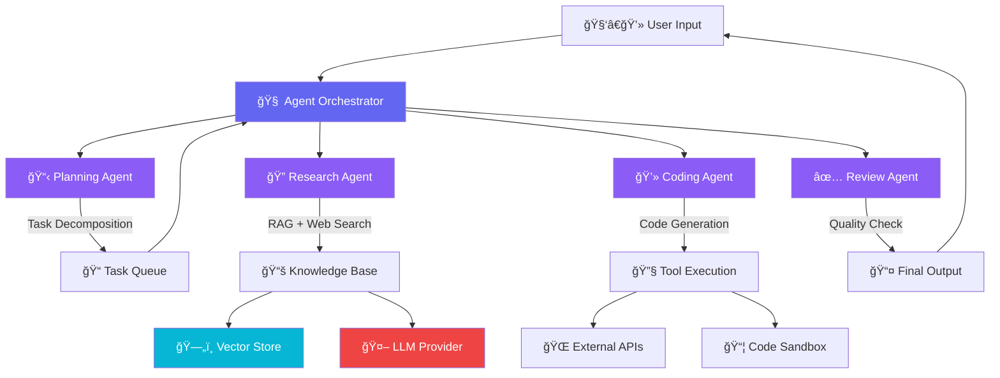

<!-- ═══════════════════════════════════════════════════════════════════════ -->
<!--                          HEADER SECTION                              -->
<!-- ═══════════════════════════════════════════════════════════════════════ -->

<p align="center">
  
</p>

<!-- Animated AI Banner GIF -->
<p align="center">
  
</p>

<p align="center">
  <a href="https://git.io/typing-svg">
    
  </a>
</p>

<!-- Animated Line Divider -->
<p align="center">
  
</p>

<!-- ═══════════════════════════════════════════════════════════════════════ -->
<!--                        SOCIAL BADGES                                  -->
<!-- ═══════════════════════════════════════════════════════════════════════ -->

<p align="center">
  <a href="https://linkedin.com/in/muhammadzeeshan007" target="_blank">
    
  </a>&nbsp;
  <a href="https://twitter.com/malikzeesh7398" target="_blank">
    
  </a>&nbsp;
  <a href="mailto:malikzeeshan3.1417@gmail.com">
    
  </a>&nbsp;
  <a href="https://drive.google.com/file/d/1oPe5OX47gXrpaY6jgmdFZMEowBaCxu2w/view" target="_blank">
    
  </a>&nbsp;
  
</p>

<!-- Animated Tech Icons -->
<p align="center">
  &nbsp;
  &nbsp;
  &nbsp;
  &nbsp;
  &nbsp;
  
</p>

<!-- ═══════════════════════════════════════════════════════════════════════ -->
<!--                         ABOUT ME                                      -->
<!-- ═══════════════════════════════════════════════════════════════════════ -->

##  About Me

<table>
<tr>
<td width="60%">

```yaml
name: Muhammad Zeeshan
role: AI Engineer & Full Stack Developer
company: Founder @ BOOM AI
location: Pakistan 🇵🇰

currently_building:
  - 🤖 Autonomous AI Agent systems with multi-agent orchestration
  - 🧠 Production-grade RAG pipelines with advanced retrieval strategies
  - 🔗 Agentic AI workflows using LangGraph, CrewAI & AutoGen
  - 🌐 Full-stack AI-powered web applications

expertise:
  - Large Language Models (GPT-4, Claude, Gemini, LLaMA, Mistral)
  - AI Agents & Agentic AI Architecture
  - Retrieval Augmented Generation (RAG)
  - Fine-tuning & RLHF
  - Full Stack Development (React, Next.js, FastAPI, Node.js)
  - MLOps & Cloud Deployment

fun_fact: "I don't just use AI — I build AI that builds things 🚀"
```

</td>
<td width="40%" align="center">


<br/><br/>


</td>
</tr>
</table>

<!-- Animated Divider -->
<p align="center">
  
</p>

<!-- ═══════════════════════════════════════════════════════════════════════ -->
<!--                    EXPERTISE DOMAIN CARDS                             -->
<!-- ═══════════════════════════════════════════════════════════════════════ -->

##  Core Expertise Domains

<table>
<tr>
<td width="50%" valign="top">

### 🤖 AI Agents & Agentic AI
- Multi-Agent Orchestration Systems
- Tool-Use & Function Calling Agents
- ReAct, Plan-and-Execute Patterns
- Autonomous Task Decomposition
- Agent Memory & State Management
- Human-in-the-Loop Workflows

</td>
<td width="50%" valign="top">

### 🧬 LLMs & Generative AI
- LLM Fine-Tuning (LoRA, QLoRA, PEFT)
- Prompt Engineering & Chain-of-Thought
- RLHF & DPO Alignment
- Multimodal AI (Vision + Language)
- Model Optimization & Quantization
- Inference Optimization (vLLM, TGI)

</td>
</tr>
<tr>
<td width="50%" valign="top">

### 📚 RAG & Knowledge Systems
- Advanced Retrieval Strategies
- Hybrid Search (Dense + Sparse)
- Agentic RAG with Self-Reflection
- Document Processing Pipelines
- Knowledge Graph Integration
- Evaluation & Benchmarking (RAGAS)

</td>
<td width="50%" valign="top">

### 🌐 Full Stack & MLOps
- React / Next.js / FastAPI / Node.js
- CI/CD for ML Pipelines
- Model Serving & API Design
- Containerization & Orchestration
- Cloud-Native AI Architectures
- Real-Time Streaming & WebSockets

</td>
</tr>
</table>

<!-- Animated Divider -->
<p align="center">
  
</p>

<!-- ═══════════════════════════════════════════════════════════════════════ -->
<!--                       TECH STACK                                      -->
<!-- ═══════════════════════════════════════════════════════════════════════ -->

##  Tech Arsenal

<!-- Animated Tech Stack Icons Row -->
<p align="center">
  
</p>

<details>
<summary><b>🤖 AI / ML / LLM Frameworks (click to expand)</b></summary>
<br/>

| Category | Technologies |
|----------|-------------|
| **LLM Frameworks** |      |
| **LLM Providers** |       |
| **Deep Learning** |     |
| **ML & Data** |     |
| **Vector Databases** |      |

</details>

<details>
<summary><b>🌐 Full Stack Development (click to expand)</b></summary>
<br/>

| Category | Technologies |
|----------|-------------|
| **Frontend** |      |
| **Backend** |      |
| **Databases** |     |

</details>

<details>
<summary><b>☁️ Cloud & DevOps (click to expand)</b></summary>
<br/>

| Category | Technologies |
|----------|-------------|
| **Cloud** |     |
| **DevOps & MLOps** |      |
| **Tools** |     |

</details>

<!-- Animated Divider -->
<p align="center">
  
</p>

<!-- ═══════════════════════════════════════════════════════════════════════ -->
<!--                    AGENTIC AI ARCHITECTURE                            -->
<!-- ═══════════════════════════════════════════════════════════════════════ -->

##  What I Build — Agentic AI Architecture



<!-- Animated Divider -->
<p align="center">
  
</p>

<!-- ═══════════════════════════════════════════════════════════════════════ -->
<!--                       GITHUB STATS                                    -->
<!-- ═══════════════════════════════════════════════════════════════════════ -->

##  GitHub Analytics

<!-- Animated Stats Cards -->
<p align="center">
  
  
</p>

<!-- 3D Contribution Calendar -->
<p align="center">
  <picture>
    <source media="(prefers-color-scheme: dark)" srcset="https://raw.githubusercontent.com/MalikZeeshan1122/MalikZeeshan1122/main/profile-3d-contrib/profile-night-rainbow.svg" />
    <source media="(prefers-color-scheme: light)" srcset="https://raw.githubusercontent.com/MalikZeeshan1122/MalikZeeshan1122/main/profile-3d-contrib/profile-south-season-animate.svg" />
    
  </picture>
</p>

<!-- Trophies -->
<p align="center">
  
</p>

<!-- Activity Graph -->
<p align="center">
  
</p>

<!-- GitHub Metrics -->
<p align="center">
  
</p>
<p align="center">
  
  
  
</p>

<!-- Animated Divider -->
<p align="center">
  
</p>

<!-- ═══════════════════════════════════════════════════════════════════════ -->
<!--                    FEATURED PROJECTS                                  -->
<!-- ═══════════════════════════════════════════════════════════════════════ -->

##  Featured Projects & Contributions

<p align="center">
  <a href="https://github.com/MalikZeeshan1122?tab=repositories">
    
  </a>
</p>

<table>
<tr>
<td width="50%">

### 🤖 AI Agents & Agentic AI
| Project | Description |
|---------|-------------|
| 🧠 **Multi-Agent System** | Autonomous agent orchestration with LangGraph |
| 🔗 **Agentic RAG Pipeline** | Self-correcting RAG with agent-based retrieval |
| 🛠️ **AI Tool-Use Agent** | Function-calling agent with custom tool registry |
| 💬 **Conversational Agent** | Multi-turn agent with persistent memory |

</td>
<td width="50%">

### 🌐 Full Stack AI Apps
| Project | Description |
|---------|-------------|
| 📄 **AI Document Analyst** | RAG-powered document QA with Next.js frontend |
| 🖼️ **Vision AI Platform** | Real-time object detection & image analysis |
| 📊 **ML Dashboard** | Interactive model monitoring & analytics |
| 🤝 **AI Chatbot Platform** | Multi-model chatbot with streaming responses |

</td>
</tr>
<tr>
<td width="50%">

### 🧬 LLM & GenAI
| Project | Description |
|---------|-------------|
| 🎯 **LLM Fine-Tuning** | QLoRA fine-tuning pipeline for domain LLMs |
| ⚡ **Inference Engine** | Optimized LLM serving with vLLM & TGI |
| 📝 **Prompt Framework** | Structured prompt engineering toolkit |
| 🔄 **Model Evaluation** | Automated LLM benchmarking suite |

</td>
<td width="50%">

### ☁️ MLOps & Deployment
| Project | Description |
|---------|-------------|
| 🐳 **ML Pipeline** | End-to-end ML pipeline with Docker & K8s |
| 📈 **Experiment Tracker** | MLflow-based experiment management |
| 🔄 **CI/CD for ML** | Automated model training & deployment |
| 🏗️ **AWS AI Stack** | Serverless AI on AWS Bedrock & Lambda |

</td>
</tr>
</table>

<!-- Animated Divider -->
<p align="center">
  
</p>

<!-- ═══════════════════════════════════════════════════════════════════════ -->
<!--                       CURRENT FOCUS                                   -->
<!-- ═══════════════════════════════════════════════════════════════════════ -->

##  Current Focus — 2025/2026

<table>
<tr>
<td width="65%">

```
🔬 Research & Building
├── 🤖 Multi-Agent Systems with complex reasoning & planning
├── 🧠 Agentic RAG with self-reflection & adaptive retrieval
├── 🔗 MCP (Model Context Protocol) server implementations
├── ⚡ LLM inference optimization & edge deployment
├── 🌐 Production-grade AI SaaS applications
└── 📱 AI-powered mobile & cross-platform solutions

📖 Learning & Exploring
├── 🧬 Neuro-Symbolic AI & Structured Reasoning
├── 🔄 Continual Learning for LLM Agents
├── 🎯 Constitutional AI & Alignment Techniques
└── 🌍 Open-Source AI Model Development
```

</td>
<td width="35%" align="center">


<br/>

<!-- Random Dev Quote -->


</td>
</tr>
</table>

<!-- Animated Divider -->
<p align="center">
  
</p>

<!-- ═══════════════════════════════════════════════════════════════════════ -->
<!--                    CONTRIBUTION SNAKE                                 -->
<!-- ═══════════════════════════════════════════════════════════════════════ -->

##  Contribution Graph

<p align="center">
  <picture>
    <source media="(prefers-color-scheme: dark)" srcset="https://raw.githubusercontent.com/MalikZeeshan1122/MalikZeeshan1122/output/github-snake-dark.svg" />
    <source media="(prefers-color-scheme: light)" srcset="https://raw.githubusercontent.com/MalikZeeshan1122/MalikZeeshan1122/output/github-snake.svg" />
    
  </picture>
</p>

<!-- Animated Divider -->
<p align="center">
  
</p>

<!-- ═══════════════════════════════════════════════════════════════════════ -->
<!--                   CODING ACTIVITY & STATS                             -->
<!-- ═══════════════════════════════════════════════════════════════════════ -->

##  Coding Activity

<p align="center">
  
</p>

<!-- Weekly Breakdown Visual -->
<table align="center">
<tr>
<td align="center">

**⏰ Weekly Development Breakdown**

```text
🤖 AI/ML & LLM Development   ███████████████░░░░░   72%
🌐 Full Stack Web Dev         ████████░░░░░░░░░░░░   38%
☁️ Cloud & DevOps             ██████░░░░░░░░░░░░░░   28%
📚 Research & Learning        █████░░░░░░░░░░░░░░░   24%
🔧 Code Reviews & OSS         ████░░░░░░░░░░░░░░░░   18%
```

</td>
</tr>
</table>

<!-- Animated Divider -->
<p align="center">
  
</p>

<!-- ═══════════════════════════════════════════════════════════════════════ -->
<!--                     BLOG & CONTENT                                    -->
<!-- ═══════════════════════════════════════════════════════════════════════ -->

##  Latest Writings & Knowledge Sharing

<!-- BLOG-POST-LIST:START -->
| 📖 Topic | 🏷️ Category | 🔥 |  
|----------|-------------|-----|
| Building Production RAG Systems with LangChain & LangGraph | `Agentic AI` | ⭐⭐⭐ |
| Fine-Tuning LLMs with QLoRA — A Practical Guide | `LLMs` | ⭐⭐⭐ |
| Multi-Agent Orchestration Patterns for Complex Tasks | `AI Agents` | ⭐⭐⭐ |
| Optimizing LLM Inference with vLLM for Production | `MLOps` | ⭐⭐ |
| Full Stack AI Apps with Next.js + FastAPI + LangChain | `Full Stack` | ⭐⭐⭐ |
<!-- BLOG-POST-LIST:END -->

<!-- Animated Divider -->
<p align="center">
  
</p>

<!-- ═══════════════════════════════════════════════════════════════════════ -->
<!--                   SUPPORT & SPONSORSHIP                               -->
<!-- ═══════════════════════════════════════════════════════════════════════ -->

## ☕ Support My Work

<p align="center">
  <i>If my projects or content helped you, consider supporting my open-source journey!</i>
</p>

<p align="center">
  <a href="https://github.com/sponsors/MalikZeeshan1122">
    
  </a>&nbsp;
  <a href="https://www.buymeacoffee.com/malikzeeshan">
    
  </a>
</p>

<!-- Animated Divider -->
<p align="center">
  
</p>

<!-- ═══════════════════════════════════════════════════════════════════════ -->
<!--                       CONNECT                                         -->
<!-- ═══════════════════════════════════════════════════════════════════════ -->

##  Let's Build the Future Together

<p align="center">
  
</p>

<p align="center">
  <a href="https://git.io/typing-svg">
    
  </a>
</p>

<p align="center">
  <a href="https://linkedin.com/in/muhammadzeeshan007" target="_blank">
    
  </a>&nbsp;
  <a href="https://twitter.com/malikzeesh7398" target="_blank">
    
  </a>&nbsp;
  <a href="mailto:malikzeeshan3.1417@gmail.com">
    
  </a>&nbsp;
  <a href="https://drive.google.com/file/d/1oPe5OX47gXrpaY6jgmdFZMEowBaCxu2w/view" target="_blank">
    
  </a>&nbsp;
  <a href="https://github.com/MalikZeeshan1122" target="_blank">
    
  </a>
</p>

<p align="center">
  <b>💡 Open to collaborations on AI Agents, LLM Applications & Full Stack AI projects</b>
</p>

<!-- Animated Handshake -->
<p align="center">
  
</p>

<!-- ═══════════════════════════════════════════════════════════════════════ -->
<!--                       FOOTER                                          -->
<!-- ═══════════════════════════════════════════════════════════════════════ -->

<p align="center">
  
</p>

<p align="center">
  
</p>
